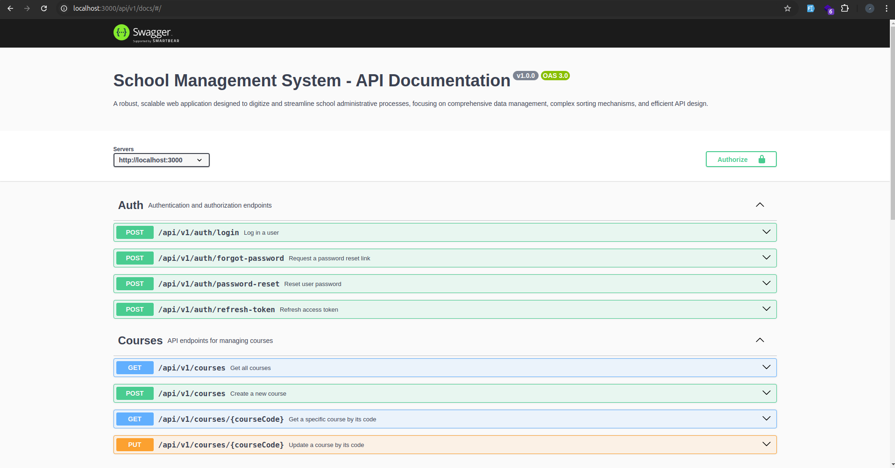
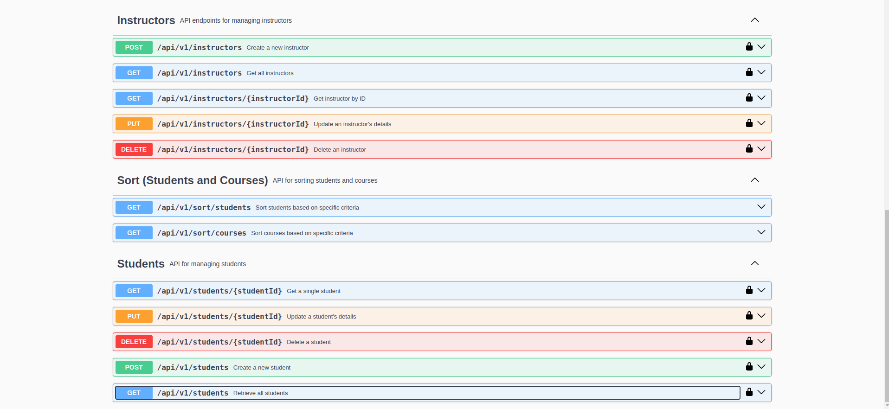

# School Administrative Web Application

## Overview

This is a robust, scalable web application designed to digitize and streamline school administrative processes. The application focuses on comprehensive data management, complex sorting mechanisms, and efficient API design, supporting entities like **Student**, **Course**, **Instructor**, and **Enrollment**.

### Features

-   **Student Management**: CRUD operations for managing student data.
-   **Course Management**: CRUD operations for managing course offerings.
-   **Enrollment Management**: Enroll students in courses and manage their course enrollment.
-   **Sorting Endpoints**: Various sorting algorithms applied to student and course data.
-   **JWT Authentication**: Secure user authentication with token-based login.

---

## Project Structure

```
.
├── package.json
├── package-lock.json
├── README.md
├── src
│   ├── controllers
│   │   ├── auth.ts
│   │   ├── courses.ts
│   │   ├── enrollments.ts
│   │   ├── instructor.ts
│   │   ├── sort.ts
│   │   └── students.ts
│   ├── logs
│   │   └── http.log
│   ├── models
│   │   ├── Course.ts
│   │   ├── Enrollment.ts
│   │   ├── Instructor.ts
│   │   ├── Student.ts
│   │   └── User.ts
│   ├── routes
│   │   ├── auth.ts
│   │   ├── courses.ts
│   │   ├── enrollments.ts
│   │   ├── instructors.ts
│   │   ├── sort.ts
│   │   └── students.ts
│   ├── script.ts
│   └── utils
│       ├── cache.ts
│       ├── dbConfig.ts
│       ├── enums.ts
│       ├── logger.ts
│       ├── mailer.ts
│       ├── middleware
│       │   ├── authenticateUser.ts
│       │   ├── handleReqBodyErrors.ts
│       │   ├── isInstructor.ts
│       │   ├── processCourses.ts
│       │   ├── rateLimitStudent.ts
│       │   └── validators
│       │       ├── auth.ts
│       │       ├── course.ts
│       │       ├── instructor.ts
│       │       └── student.ts
│       ├── sortingTechniques.ts
│       ├── swaggerConfig.ts
│       └── types
│           ├── course.d.ts
│           ├── instructor.d.ts
│           ├── jwt.d.ts
│           ├── student.d.ts
│           └── user.d.ts
└── tsconfig.json
```

---

## Features

### User Entities

#### 1. **Student**

-   Students have limited access to their own personal information such as enrolled courses.

#### 2. **Instructor**

-   Instructors have full system and management capabilities, including student account creation, course creation, etc.

### Authentication

-   **JWT-based Authentication**: All users must log in using email/password credentials to receive a JWT token for secure access to protected routes.

---

## API Routes

### Public Routes

-   **POST** `/auth/login`: Log in and retrieve a JWT token.
-   **POST** `/auth/password-reset`: Request a password reset link.

### Protected Routes

#### Student Management

-   **GET** `/students`: Retrieve all students. (Accessible to instructors only)
-   **GET** `/students/{id}`: Retrieve specific student details. (Instructors and self-access for students)
-   **POST** `/students`: Create a new student record. (Instructors only)
-   **PUT** `/students/{id}`: Update student information. (Instructors and self-access for students)
-   **DELETE** `/students/{id}`: Remove a student from the system. (Instructors only)

#### Course Management

-   **GET** `/courses`: List all courses. (Accessible to all authenticated users)
-   **GET** `/courses/{courseCode}`: Retrieve specific course details. (Accessible to all authenticated users)
-   **POST** `/courses`: Create a new course. (Instructors only)
-   **PUT** `/courses/{courseCode}`: Update course information. (Instructors only)
-   **DELETE** `/courses/{courseCode}`: Remove a course. (Instructors only)

#### Enrollment Management

-   **POST** `/enrollments`: Enroll a student in a course. (Instructors only, self-enrollment for students with restrictions)
-   **GET** `/enrollments/student/{studentId}`: Retrieve all courses for a student. (Self-access for students)
-   **GET** `/enrollments/course/{courseCode}`: Retrieve all students enrolled in a course. (Instructors only)
-   **DELETE** `/enrollments/{enrollmentId}`: Cancel an enrollment. (Instructors only, self-cancellation for students)

#### Sorting Endpoints

-   **GET** `/sort/students`: Sort student data by different fields (e.g., GPA, grade, etc.).
-   **GET** `/sort/courses`: Sort course listings based on various criteria (e.g., course duration, name, etc.).

#### Instructors Management (Instructors-specific only)

-   **GET** `/instructors`: Retrieve all instructors.
-   **GET** `/instructors/{id}`: Retrieve specific instructors details.
-   **POST** `/instructors`: Create a new student record.
-   **PUT** `/instructors/{id}`: Update instructors information.
-   **DELETE** `/instructors/{id}`: Remove a instructors from the system.

---

## Advanced Requirements

-   **Comprehensive Input Validation**: Middleware to validate inputs and ensure proper data formatting.
-   **Error Handling**: Middleware for handling errors.
-   **Logging**: Use of Winston to log system activities.
-   **Pagination**: Implemented pagination for list endpoints (students, courses).
-   **API Documentation**: Swagger-generated documentation for all endpoints.

---

## Performance Considerations

-   **Caching**: Caching strategies for commonly accessed data.
-   **Optimized Database Queries**: Ensuring fast data retrieval with optimized queries.
-   **Indexing**: Indexing frequently accessed fields for better performance.

---

## Response Example

#### Sorting Algorithm Endpoint

**GET** `/sort/students`

Request query-parameter:

```json
{
    "sortBy": "cgpa",
    "order": "asc"
}
```

Response:

```json
{
    "success": true,
    "count": 2,
    "page": 1,
    "limit": 2,
    "data": [
        { "_id": 1, "name": "Julius Markwei", "cgpa": 3.5 },
        { "_id": 2, "name": "Sherlock Holmes", "cgpa": 3.8 }
    ]
}
```

---

## Swagger API Documentation

Below is a preview of the browsable API documentation using Swagger.




---

## Installation

1.  Clone the repository:

    ```bash
    git clone https://github.com/julius-amt/SMS.git
    ```

2.  Move into the project directory

    ```bash
    cd SMS/
    ```

3.  Install dependencies:

    ```bash
    npm install
    ```

4.  Configure environment variables:

        - Create a `.env` file in the root directory.
        - Add required environment variables like database credentials, JWT secret, etc.
        - Content of `.env` file:
            * MONGODB_URI=MONGODB_URI
            * JWT_SECRET=JWT_SECRET
            * EMAIL_HOST=EMAIL_HOST
            * EMAIL_PORT=EMAIL_PORT
            * EMAIL_SECURE=EMAIL_SECURE
            * EMAIL_USER=EMAIL_USER
            * EMAIL_PASS=EMAIL_PASS
            * BASE_URL=BASE_URL

5.  Start the application:
    ```bash
    npm run dev
    ```

---

## Technologies Used

-   **Node.js**: JavaScript runtime for building scalable applications.
-   **Express.js**: Web framework for building APIs.
-   **MongoDB**: NoSQL database for storing application data.
-   **Mongoose**: ORM for interacting with MongoDB.
-   **JWT**: Token-based authentication for secure access.
-   **Winston**: Logging library for logging system activities.
-   **Swagger**: API documentation tool.
-   **TypeScript**: Typed superset of JavaScript for improved development experience.

---

## License

This project is licensed under the MIT License - see the [LICENSE](LICENSE) file for details.

---

### Placeholder for API Image

To add images for the browsable API, include the image files in your project directory and replace the placeholder path:

```md

```

---

Let me know if you need any further details or adjustments to the README!
